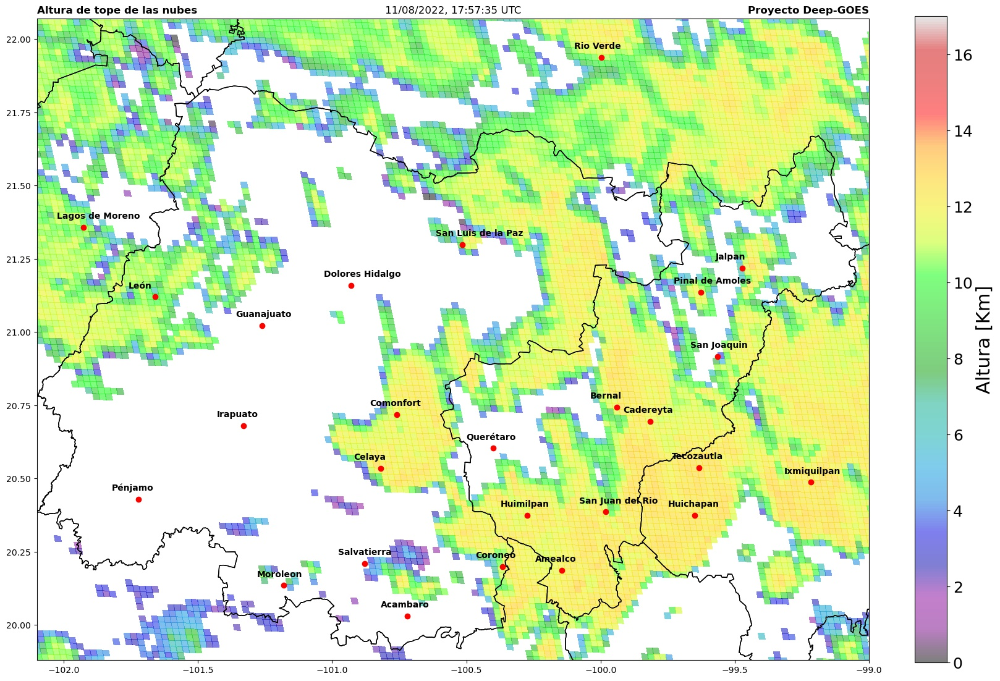

# Deep-GOES

Proyecto de Tesis de Licenciatura de Adrián Ramírez. <br>
Facultad de Ciencias, UNAM <br>
Contacto: felos@ciencias.unam.mx
<br>

Asesora de tesis <br>
Dra. Mónica Borunda Pacheco <br>
Contacto: moni.borunda@ciencias.unam.mx <br>

El objetivo de este proyecto es poder predecir las condiciones de la atmósfera a un corto plazo de 30 min a 1 hora, particularmente es de mi interés predecir la dinámica, movimiento y estabilidad de las nubes. Para ello usaré técnicas del deep-learning para intentar resolver este problema.


## Instalación de los requerimientos
Para poder usar de estos programas y scripts es necesario tener python3 instalado https://www.python.org/downloads/ <br>

Una vez instalado python instalamos las librerías requeridas con

```
pip3 install requeriments.txt
```

## Zona de estudio
Como zona de estudio para el entrenamiento de los modelos incluidos en este repositorio se escogió la zona del bajio que abarca el estado de Querétaro y Guanajuato así como sus alrededores.



## Resultados preeliminares

### Identificación de las nubes

### Estimación de la altura de las nubes

## Agradecimientos
Este estudio se incorporará en el trabajo de investigación del proyecto “Predicción del recurso solar
usando imágenes satelitales para impulsar el desarrollo sostenible en comunidades aisladas con
energía asequible y no contaminante” aprobado por el  Programa Espacial Universitario (PEU)de la Universidad Nacional Autónoma de México. Se agradece al PEU por el apoyo otorgado a este trabajo.


