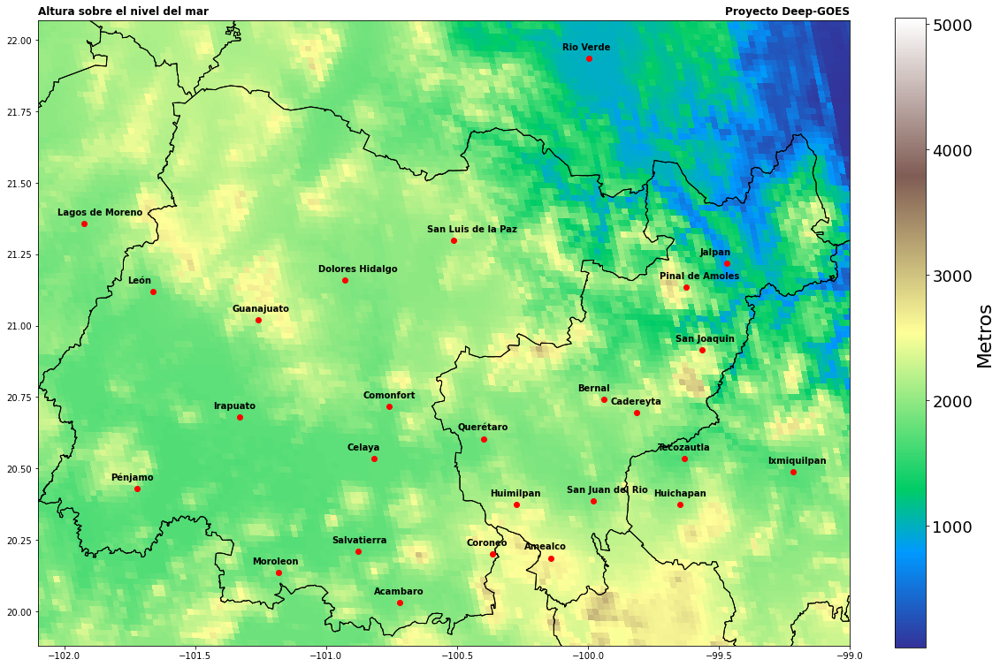
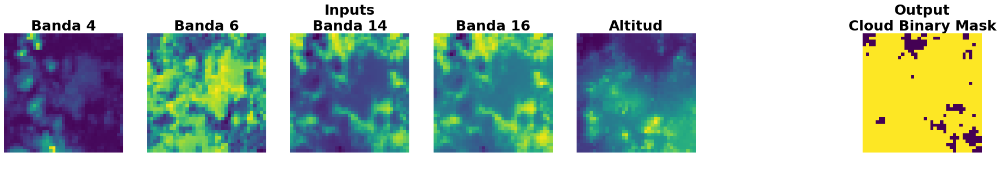
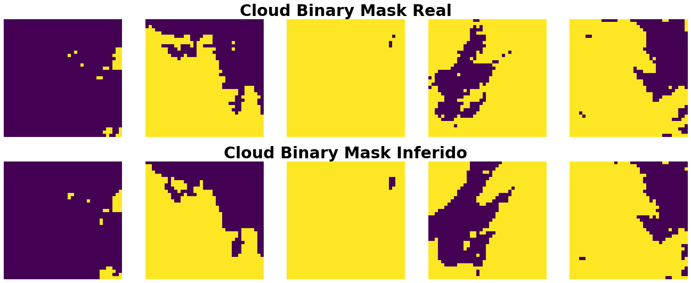
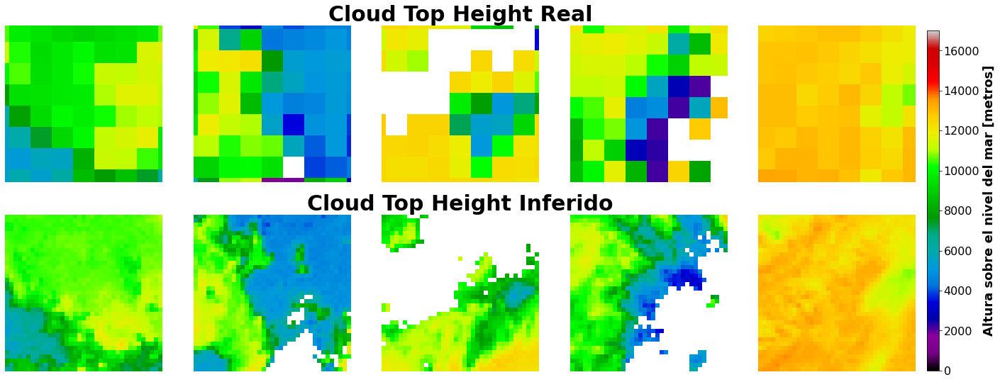

# Deep-GOES :earth_americas:

Proyecto de Tesis de Licenciatura de Adrián Ramírez. <br>
Facultad de Ciencias, UNAM <br>
Contacto: felos@ciencias.unam.mx
<br>

Asesora de tesis <br>
Dra. Mónica Borunda Pacheco <br>
Contacto: moni.borunda@ciencias.unam.mx <br>

El objetivo de este proyecto es poder predecir las condiciones de la atmósfera a un corto plazo de 30 min a 1 hora, particularmente es de mi interés predecir la dinámica, movimiento y estabilidad de las nubes. Para ello usaré técnicas del deep-learning para intentar resolver este problema.


## Instalación de los requerimientos

Para poder usar de estos programas y scripts es necesario tener python3 instalado https://www.python.org/downloads/ <br>


Una vez instalado python instalamos las librerías requeridas con

```
pip3 install requeriments.txt
```
:warning: Para poder usar tambien los notebooks incluidos se recomienda tambien instalar anaconda https://www.anaconda.com/

## Descarga de los datos satelitales

:bell: Esta sección es sobre todo útil si se desea obtener nuevos datos satélitales para el re-entrenamiento de los modelos de deep-learning. Si lo que se desea es solo usar los modelos pre-entrenados consultar las secciones siguientes.

El script para la descarga de los datos satelitales se encuentra en el directorio de **gendata**. La descarga de los datos es administrada en su totalidad por el script *gendata.py*.<br>

La configuración de la descarga se encuentra en el archivo *gendata.config*. Modificando los parámetros dentro de este archivo se modifica el comporamiento del script *gendata.py*.<br>

Los parámetros disponibles son:

| Parametro       | valor por Default | Descripcion                                                    |
|-----------------|-------------------|----------------------------------------------------------------|
| nombre_dataset  | dataset           | Nombre del archivo con los datos recopilados.                  |
| num_dias        | 3                 | Numero de dias de los que se descargaran los datos satelitales |
| fecha_inicio    | 2022/07/24        | Fecha de inicio para la descarga de los datos satelitales      |
| fecha_final     | 2022/07/26        | Fecha final  para la descarga de los datos satelitales, si num_dias es menor que los dias dentro del intervalo de fecha_inicio y fecha_final entonces los dias se escogeran de manera equidistante en este intervalo.|
| hora_inicio_utc | 00:00             | Hora de inicio para la descarga de los datos de cada uno de los días, la hora debe de estar en el uso horario UTC. Esta configuración puede ser muy útil si solo se desea descargar los datos satélitales en las horas con luz solar por ejemplo.|
| hora_final_utc  | 23:59             | Hora final para la descarga de los datos de cada uno de los días, la hora debe de estar en el uso horario UTC.|
| saltear_archivos| 2                 | De entre los archivos encontrados para su descarga dado las configuraciones anteriores solo se tomarán cada cierto número de archivos salteados. Por ejemplo, los datos satelitales se publican cada 5 min. Si solo queremos descargar datos cada 10 min, entonces establecemos saltear_archivos en 2, así solo se tomará 1 archivo de cada 2 disponibles.|
| bandas  | 4,6,14,16,CBM,COD,CTH,CTP | Las bandas y productos que se descargarán. Productos disponibles: 1,2,3,4,5,6,7,8,9,10,11,12,13,14,15,16,CBM,CTH,COD,CAPE,CTP.Para más información acerca de estas bandas y productos consultar las secciones siguientes.|
| ventana  | 18           | Número de pixeles de radio de cada una de las imágenes obtener,  el tamaño final de las imágenes estará dado por (ventana*2)+1|
| reescalado  | 2           | No todas las bandas y productos tienen la misma resolución espacial, por lo que para formar el dataset es necesario reescalar las bandas a una resolución común. La configuración esta dada en kilómetros.|
| limite_inferior_latitud | 19.80 | Cordenada que limitará la región de donde se obtendran los datos.|
| limite_superior_latitud | 21.81 | Coordenada que limitará la región de donde se obtendran los datos.|
| limite_inferior_longitud | -102.18 | Coordenada que limitará la región de donde se obtendran los datos.|
| limite_superior_longitud | -99.0 | Coordenada que limitará la región de donde se obtendran los datos.|
| resolucion_grid | 30 | Se dividirá la región indicada por las coordendas en un grid o en cuadrantes cuyo número dependerá de esta configuración. En cada uno de estos cuadrantes se obtendrán los datos satélitales. El número de cuadrantes generados  es igual a la resolucion_grid² |

### :warning: Limitaciones
* El satélite GOES-16 fue puesto en operación en el 2016, recomiendo solo descargar datos apartir del 2017.
* La región geográfica indicada con las coordenadas solo puede estar dentro de los siguientes paises y regiones:<br> México :mexico:, Estados Unidos :us:, Cuba :cuba:, Haiti :haiti: ,República Dominicana :dominican_republic:, el golfo de México y parte del mar caribe. 
 
Una vez establecidos los parámetros deseados el siguiente paso es ejecutar el script gendata.py

```
python3 gendata.py
```

El resultado del script será un archivo .h5 ubicado en /gendata/Datasets/ , este archivo contendrá toda la información recopilada segun las configuraciones de fecha ,coordenadas, y bandas indicadas.<br>

 :bell: Para un ejemplo de como examinar el archivo .h5 ver los notebooks incluidos en el repositorio.

## Modelos pre-entrenados :construction: En progreso :construction:

### Zona de estudio
Como zona de estudio para el entrenamiento de los modelos incluidos en este repositorio se escogió la zona del bajio que abarca el estado de Querétaro y Guanajuato así como sus alrededores.




### Modelo para la identificación de nubosidad

Este modelo entrenado con el producto de CBM (Cloud Binary Mask) del satélite GOES-16 es capaz de identificar las zonas con nubosidad. El modelo pre-entrenado alcanza una presición del 96% en referencia al producto CBM.

:memo: Este modelo demuestra las capacidades del deep-learning y las redes neuronales con el uso de datos satelitales. Adicionalmente puede ser utilizado como reemplazo del producto de Cloud Binary Mask (CBM) cuando no este disponible.

#### Inputs
Como entrada el modelo requiere unas imágenes 37x37 con los siguientes canales:
* Banda 4
* Banda 6
* Banda 14
* Banda 16
* Altura sobre el nivel del mar

#### Output
Imágenes 37x37 con los valores 1 donde se ha identificado nubosidad (color amarillo) y 0 donde no se ha identificado ninguna nubosidad (color morado).



#### Resultados :robot:


*Comparativa del producto Cloud Binary Mask y los resultados del modelo de deep-lerning.<br>Arriba: Algoritmo Cloud Binary Mask del satélite.<br>Abajo: Modelo entrenado*

#### Detalles para el entrenamiento
:bell: Se requiere tener instalado conda usar los notebooks de entrenamiento. 

 :bell: Se recomienda tener una GPU (targeta gráfica) nvidia  en el equipo en el que se entrene el modelo. Así como los drivers y CUDA instalado.

Para re-entrenar este modelo hay que seguir los siguientes pasos:
1. Descargar y general un dataset con el script **gendata.py**, el dataset debe de tener las bandas 4,6,14,16,Altura,CM
2. Correr las celdas del jupyter notebook ubicado en /Notebooks/Entrenamiento/CBM.ipynb

### Modelo para la estimación de la altura de las nubes
Una vez identificadas las nubes ya sea con el Cloud Binary Mask o con el modelo de identificación de nubes el siguiente paso es identificar la altura de estas.<br>
El siguiente modelo está entrenado con el producto Cloud Top Height (CTH) del satélite. 

:memo: Con este modelo se pretende mejorar la resolución del producto CTH del satélite de 10km a 2km por pixel.

#### Inputs
Como entrada el modelo requiere unas imágenes 37x37 con los siguientes canales:
* Banda 4
* Banda 6
* Banda 14
* Banda 16
* Altura sobre el nivel del mar
* Cloud Binary Mask (CBM)

#### Output
Imágenes 37x37 con los valores de la altura del tope de las nubes a una resolución de 2km por pixel.

#### Resultados :robot:
A continuación se muestra una comparativa del producto de Cloud Top Height del satelite contra lo estimado por el modelo de deep-learning.




## Agradecimientos
Este estudio se incorporará en el trabajo de investigación del proyecto “Predicción del recurso solar
usando imágenes satelitales para impulsar el desarrollo sostenible en comunidades aisladas con
energía asequible y no contaminante” aprobado por el  Programa Espacial Universitario (PEU)de la Universidad Nacional Autónoma de México. Se agradece al PEU por el apoyo otorgado a este trabajo.


